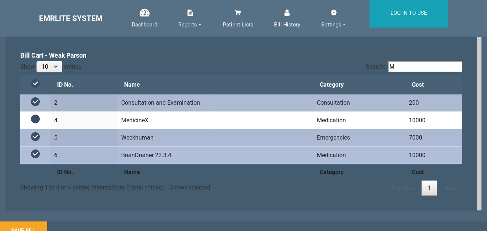

# EMRLite
Lenest Hospital's Custom EMR and Health Management System.
Custom tailored to meet the needs of multi specialty hospital lenest(Gynaecology,Obstretic,Pediatrics).

## Installation

Any Linux machine with python installed should be able to run this.

##### Steps for Installation-

This project is built on python3.

1. Install the requirements ``pip install -r requirements.txt``
2. Migrate the database with ``python manage.py migrate``
3. Start the server with ``python manage.py runserver`` and visit the address to view it

Note: You may need to make a keyconfig file with the module-level variables and API keys for the settings.

## Features

The EMRLite Project is a complete Billing and Health-Management System. The system allows you to manage your bill effectively on a server and generates the bill as per the items chosen.

### Key Features

- Patient Management Portal - Patient List,
- Billing Items and Cost Management - Overview of prices, modification of bill
- Login Authentication for Users - Seperate users for staff members
- Patient Selector - A complete Datatable with search functionality which allows you to select the patient.
- Billing Cart - A complete Datatable which allows you to choose the items which are required for bill generation.

## Projects for the Le' Nest Hospital

Other projects for the Le' Nest Hospital include-
- [suvigyavijay/revampLenest](https://github.com/suvigyavijay/revampLenest)
- [Chinmay-pathak/Chatbot Lenest](https://github.com/Chinmay-pathak/Chatterbot)
